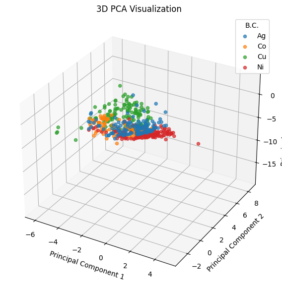
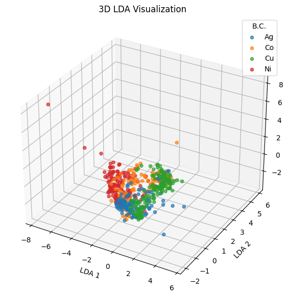

# PREFERABLY USE THE GOOGLE COLAB FOR REVIEW:
https://colab.research.google.com/drive/1ayDcA2SnIbjR9OQD0aQxI9OHfuosBvHy?usp=sharing

## Overview
This project focuses on learning and applying **Principal Component Analysis (PCA)**, a fundamental technique for dimensionality reduction and data visualization. The goal is to understand how PCA works, implement it from scratch, and apply it to datasets to reduce dimensions while preserving the most important information.

---
```python
import pandas as pd
from sklearn.decomposition import PCA
from sklearn.preprocessing import StandardScaler
from sklearn.discriminant_analysis import LinearDiscriminantAnalysis as LDA
import matplotlib.pyplot as plt
from mpl_toolkits.mplot3d import Axes3D
import numpy as np

from google.colab import files
```


```python
df = pd.read_excel('4BC.xlsx')
```


```python
df.head()
```


  <div id="df-cb2d8369-cc76-46f5-b6bc-079d2e954198" class="colab-df-container">
    <div>

<table border="1" class="dataframe">
  <thead>
    <tr style="text-align: right;">
      <th></th>
      <th>id</th>
      <th>B.C.</th>
      <th>FF</th>
      <th>Rs</th>
      <th>Rsh</th>
      <th>VOC(mV)</th>
      <th>jsc(µA/cm2)</th>
    </tr>
  </thead>
  <tbody>
    <tr>
      <th>0</th>
      <td>1</td>
      <td>Ag</td>
      <td>42.050778</td>
      <td>1201.02073</td>
      <td>3207157.274</td>
      <td>313.589943</td>
      <td>9.080000</td>
    </tr>
    <tr>
      <th>1</th>
      <td>2</td>
      <td>Ag</td>
      <td>31.448339</td>
      <td>23063.72733</td>
      <td>1139940.919</td>
      <td>305.736250</td>
      <td>14.441089</td>
    </tr>
    <tr>
      <th>2</th>
      <td>3</td>
      <td>Ag</td>
      <td>44.528443</td>
      <td>77754.33149</td>
      <td>2474439.611</td>
      <td>403.290236</td>
      <td>14.900000</td>
    </tr>
    <tr>
      <th>3</th>
      <td>4</td>
      <td>Ag</td>
      <td>42.470062</td>
      <td>60349.26229</td>
      <td>2323488.838</td>
      <td>402.432026</td>
      <td>14.800000</td>
    </tr>
    <tr>
      <th>4</th>
      <td>5</td>
      <td>Ag</td>
      <td>42.710457</td>
      <td>141620.04100</td>
      <td>2582383.661</td>
      <td>407.892966</td>
      <td>13.500000</td>
    </tr>
  </tbody>
</table>
</div>
    <div class="colab-df-buttons">

  <div class="colab-df-container">
    <button class="colab-df-convert" onclick="convertToInteractive('df-cb2d8369-cc76-46f5-b6bc-079d2e954198')"
            title="Convert this dataframe to an interactive table."
            style="display:none;">

  <svg xmlns="http://www.w3.org/2000/svg" height="24px" viewBox="0 -960 960 960">
    <path d="M120-120v-720h720v720H120Zm60-500h600v-160H180v160Zm220 220h160v-160H400v160Zm0 220h160v-160H400v160ZM180-400h160v-160H180v160Zm440 0h160v-160H620v160ZM180-180h160v-160H180v160Zm440 0h160v-160H620v160Z"/>
  </svg>
    </button>

 


<div id="df-bb666809-5574-48b6-8ba9-b785e4a82a13">
  <button class="colab-df-quickchart" onclick="quickchart('df-bb666809-5574-48b6-8ba9-b785e4a82a13')"
            title="Suggest charts"
            style="display:none;">


#1. Using PCA on the features

Separating the features from the target column


```python
features = df.drop(['B.C.', 'id'], axis=1)
target = df['B.C.']
```

Noramlizing the features


```python
scaler = StandardScaler()
scaled_features = scaler.fit_transform(features)
```

Performing PCA


```python
pca = PCA(n_components=3)
principal_components = pca.fit_transform(scaled_features)
```

#2. Displaying the 3D graph

Creating the new DataFrame for the PCs


```python
pca_df = pd.DataFrame(data=principal_components, columns=['PC1', 'PC2', 'PC3'])
pca_df['B.C.'] = target
```

Displaying


```python
fig = plt.figure(figsize=(10, 7))
ax = fig.add_subplot(111, projection='3d')

unique_targets = pca_df['B.C.'].unique()

for target in unique_targets:
    subset = pca_df[pca_df['B.C.'] == target]
    ax.scatter(subset['PC1'], subset['PC2'], subset['PC3'], label=target, alpha=0.7)

ax.set_title("3D PCA Visualization")
ax.set_xlabel("Principal Component 1")
ax.set_ylabel("Principal Component 2")
ax.set_zlabel("Principal Component 3")
ax.legend(title="B.C.")
plt.show()
```


    

    


#3. Explained Variance & Eigenvalue


```python
explained_variance = pca.explained_variance_ratio_
eigenvalues = pca.explained_variance_

print("Explained Variance Ratios:", explained_variance)
print("Eigenvalues:", eigenvalues)
print("Total Explained Variance:", sum(explained_variance))
```

    Explained Variance Ratios: [0.29588819 0.25891226 0.19897799]
    Eigenvalues: [1.48214067 1.29692364 0.99670546]
    Total Explained Variance: 0.753778445105806
    

#4. Finding & Removing Ouliers


```python
pca_space = principal_components
pca_mean = np.mean(pca_space, axis=0)
distances = np.sqrt(np.sum((pca_space - pca_mean) ** 2, axis=1))

# Points farther than 3 standard deviations)
threshold = np.mean(distances) + 3 * np.std(distances)
outliers = np.where(distances > threshold)[0]

print("\nOutliers:")
print(df.iloc[outliers])
```

    
    Outliers:
          id B.C.           FF            Rs           Rsh  VOC(mV)  jsc(µA/cm2)
    89    90   Ag     0.000000  1.453024e+04  5.247565e+09    0.000          0.0
    91    92   Ag     0.000000  2.778976e+09  2.361252e+09    0.000          0.0
    100  101   Ag  8272.050148  3.562224e+05  6.836334e+03    1.830         10.6
    104  105   Ag  5585.794646  3.819499e+05  3.200266e+03    0.899         10.9
    

We can see the outliers from the 3D visualiztion and from the outlier detection above.
These 4 outliers (id: 90,92,101,105) have very high/low values that don't correspond with the rest of their respected features.
The other outlier (id: 248) was not found in the in the code detection above but we could detect it in the 3D visualization. Going through the Dataset we could find this outlier that only has it's "Rs" value to be very low while the rest of it's values are normal.

#5. Removing outliers & Repeating steps 2,3

Creating new DataFrame without the outliers mentioned in previous step


```python
df_cleaned = df.drop(index=[89, 91, 100, 104, 249])
features_cleaned = df_cleaned.drop(['B.C.', 'id'], axis=1)
target_cleaned = df_cleaned['B.C.']
```

Scaling & PCA


```python
features_scaled_cleaned = scaler.fit_transform(features_cleaned)

pca_cleaned = PCA(n_components=3)
principal_components_cleaned = pca_cleaned.fit_transform(features_scaled_cleaned)
```

Creating the new DataFrame


```python
target_cleaned = target_cleaned.reset_index(drop=True)
pca_df_cleaned = pd.DataFrame(data=principal_components_cleaned, columns=['PC1', 'PC2', 'PC3'])
pca_df_cleaned['B.C.'] = target_cleaned
```

Displaying 3D graph for the cleaned DataFrame


```python
fig = plt.figure(figsize=(10, 7))
ax = fig.add_subplot(111, projection='3d')

unique_targets = pca_df_cleaned['B.C.'].unique()

for target in unique_targets:
    subset = pca_df_cleaned[pca_df_cleaned['B.C.'] == target]
    ax.scatter(subset['PC1'], subset['PC2'], subset['PC3'], label=target, alpha=0.7)

ax.set_title("3D PCA Visualization")
ax.set_xlabel("Principal Component 1")
ax.set_ylabel("Principal Component 2")
ax.set_zlabel("Principal Component 3")
ax.legend(title="B.C.")
plt.show()
```


    

    


#6. Using a different method (LDA)

Using the cleaned features from previous steps for LDA


```python
features_scaled_cleaned = scaler.fit_transform(features_cleaned)

lda = LDA(n_components=3)
lda_components = lda.fit_transform(features_scaled_cleaned, target_cleaned)
```

Creating the new DataFrame


```python
lda_df = pd.DataFrame(data=lda_components, columns=['LDA1', 'LDA2', 'LDA3'])
lda_df['B.C.'] = target_cleaned.reset_index(drop=True)
lda_df['B.C.'] = target_cleaned
```

Displaying 3D graph for the cleaned DataFrame


```python
fig = plt.figure(figsize=(10, 7))
ax = fig.add_subplot(111, projection='3d')

unique_targets = lda_df['B.C.'].unique()

for target in unique_targets:
    subset = lda_df[lda_df['B.C.'] == target]
    ax.scatter(subset['LDA1'], subset['LDA2'], subset['LDA3'], label=target, alpha=0.7)

ax.set_title("3D LDA Visualization")
ax.set_xlabel("LDA 1")
ax.set_ylabel("LDA 2")
ax.set_zlabel("LDA 3")
ax.legend(title="B.C.")
plt.show()
```


    

    

